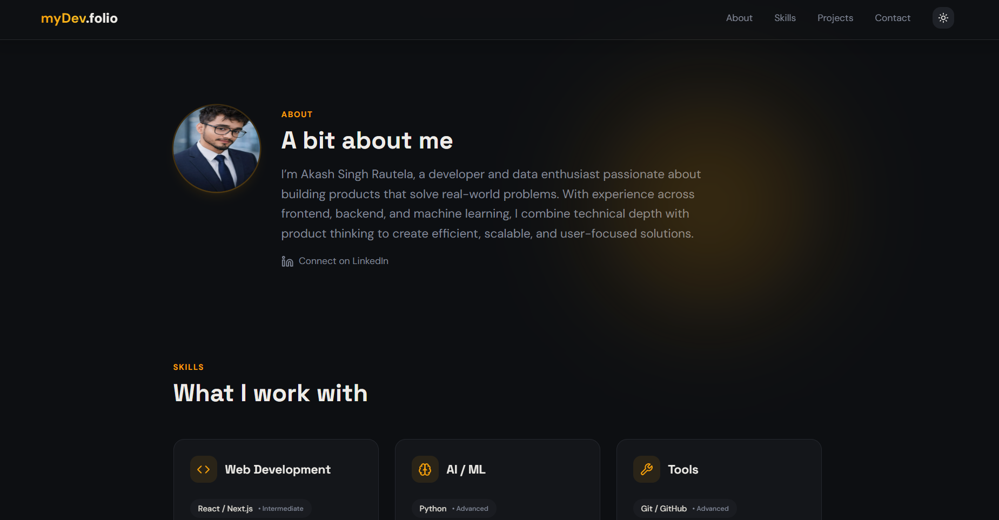
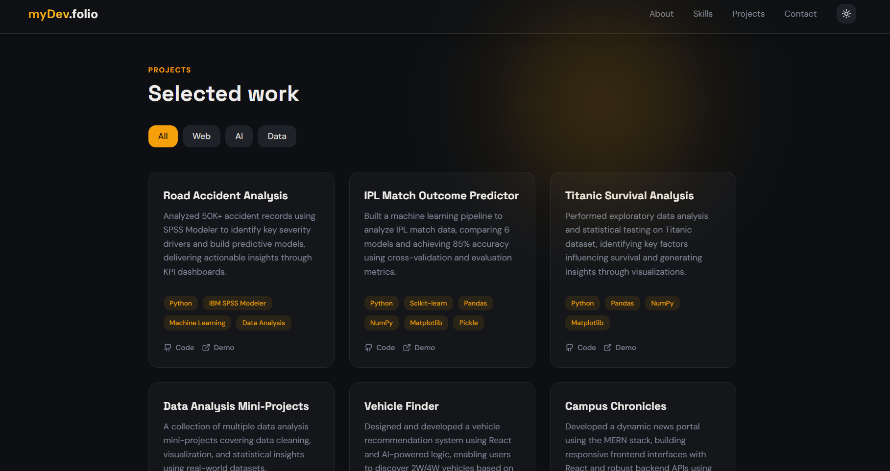

# 🚀 myDev.folio — Developer Portfolio

<p align="center">
  <b>A modern, responsive developer portfolio built with React, Tailwind CSS, and motion-driven UI.</b><br/>
  Designed to present your projects, skills, and contact details in a polished single-page experience.
</p>

<p align="center">
  
  
  
  
  
</p>

---

## 🌐 Live Demo

[https://my-dev-folio-six.vercel.app/](https://my-dev-folio-six.vercel.app/)

---

## ✨ Overview

**myDev.folio** is a polished developer portfolio template featuring:

- Smooth, responsive layout for desktop and mobile
- Animated hero section with 3D tech visuals
- Projects showcase with clean cards
- Skills and experience sections
- Contact section with email-ready form
- Theme support and modern UI animations

---

## 📸 Screenshots

<p align="center">
  
</p>

<p align="center">
  
</p>

---

## 🛠️ Tech Stack

| Category       | Technology        |
|---------------|-------------------|
| Framework      | React 18          |
| Build Tool     | Vite              |
| Styling        | Tailwind CSS      |
| Animations     | Framer Motion     |
| 3D Graphics    | React Three Fiber |
| Icons          | Lucide React      |
| Forms          | EmailJS           |
| Routing        | React Router DOM  |

---

## 🚀 Features

- Fully responsive portfolio layout
- Animated sections and page transitions
- Interactive project and skills sections
- Theme-enabled UI
- Lightweight Vite development workflow
- Clean component-based structure

---

## 🧰 Getting Started

### Prerequisites

- Node.js 18+ or later
- npm

### Setup

```bash
git clone https://github.com/akash-rautela/myDev.folio.git
cd myDev.folio
npm install
```

### Run Locally

```bash
npm run dev
```

Then open the local URL shown in the terminal.

### Build for Production

```bash
npm run build
```

### Preview Production Build

```bash
npm run preview
```

---

## 📁 Project Structure

```text
src/
  ├── components/
  ├── hooks/
  ├── lib/
  ├── pages/
  ├── App.tsx
  ├── main.tsx
  └── index.css
```

---

## 🤝 Contributing

Contributions are welcome! To contribute:

1. Fork the repository
2. Create a new branch
3. Make your changes
4. Open a pull request

---

## 📬 Connect

- GitHub: [akash-rautela](https://github.com/akash-rautela)
- Live Demo: [https://my-dev-folio-six.vercel.app/](https://my-dev-folio-six.vercel.app/)

<p align="center">Made with ❤️ by Akash Rautela</p>
